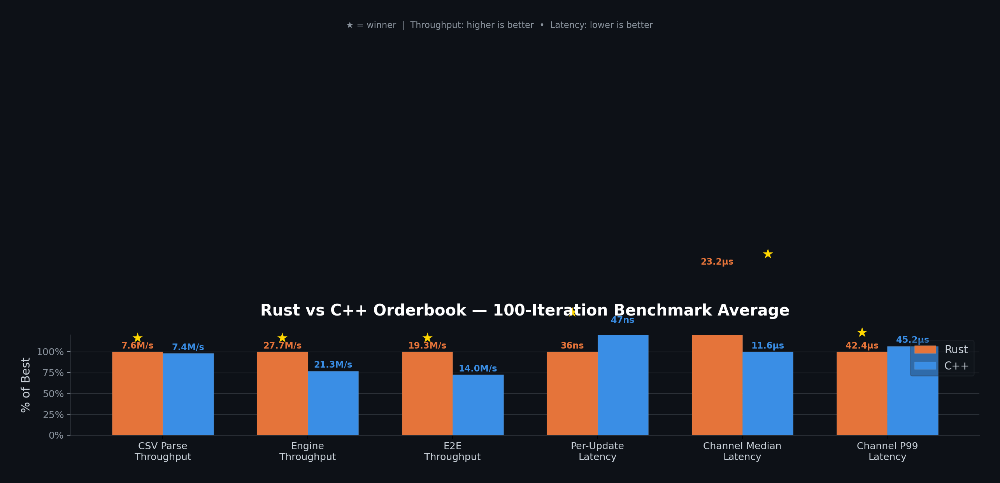

# Ultra-Low-Latency Orderbook System — Rust vs C++

Two independent implementations of a high-performance L2 orderbook engine + strategy consumer, optimized for minimum latency and maximum throughput. Both process the same BTC/USDT dataset and produce identical results, enabling an apples-to-apples performance comparison.

## Project Structure

```
.
├── Makefile                    # Root orchestrator (builds/runs both)
├── compare_benchmarks.sh       # 100-iteration head-to-head comparison
├── btc_orderbook_updates.csv   # Input dataset (2242 updates, CRLF)
├── orderbook system.md         # Original assignment spec
├── rust/                       # Rust implementation
│   ├── Cargo.toml
│   ├── Makefile
│   └── src/
│       ├── main.rs             # Orchestrator: CSV → engine → channel → strategy
│       ├── bench.rs            # Dedicated benchmark binary
│       ├── types.rs            # Price, Qty, Level, Update, BookNotification
│       ├── orderbook.rs        # BTreeMap + cached best bid/ask
│       ├── parser.rs           # mmap CSV parser (manual byte-level)
│       └── strategy.rs         # Strategy consumer with latency tracking
└── cpp/                        # C++ implementation
    ├── Makefile
    └── src/
        ├── main.cpp            # Orchestrator
        ├── benchmark.cpp       # Dedicated benchmark binary
        ├── types.h             # Equivalent types
        ├── orderbook.h         # std::map + cached best bid/ask
        ├── parser.h            # mmap CSV parser
        ├── strategy.h          # Strategy consumer
        ├── spsc_queue.h        # Custom lock-free SPSC ring buffer
        └── clock.h             # CLOCK_MONOTONIC_RAW + RDTSC
```

## Quick Start

```bash
make build           # Build both Rust and C++ (optimized, native CPU)
make run             # Run both implementations
make benchmark       # Run individual benchmarks for each
make compare         # Head-to-head: 100 iterations each, averaged
make test            # Run Rust unit tests
make clean           # Clean both build artifacts
```

You can also build/run each language independently:

```bash
make build-rust      # Build Rust only
make run-cpp         # Run C++ only
make benchmark-rust  # Benchmark Rust only
```

## Architecture

Both implementations share the same architecture:

```
[CSV mmap reader] → parse_all() → Vec<Update>  (pre-parsed, zero runtime alloc)
       ↓
[Engine thread]   → Orderbook::apply()          (sorted map, cached best bid/ask)
       ↓  bounded SPSC channel (4096 slots)
[Strategy thread] → reads best bid/ask, logs    (lock-free single-producer single-consumer)
```

### Design Choices

| Component | Rust | C++ |
|---|---|---|
| **File I/O** | `memmap2` | raw `mmap(2)` |
| **CSV Parsing** | Hand-rolled byte parser | Hand-rolled byte parser + `memchr` |
| **Price** | Fixed-point `u64` (×100) | Fixed-point `uint64_t` (×100) |
| **Orderbook** | `BTreeMap<Price, Qty>` | `std::map<uint64_t, double>` |
| **Best Bid/Ask** | Cached, O(1) | Cached, O(1) |
| **Channel** | `crossbeam-channel` bounded(4096) | Custom lock-free SPSC ring buffer |
| **Timing** | `quanta::Clock` (TSC) | `clock_gettime(MONOTONIC_RAW)` + RDTSC |
| **Opt Flags** | `lto=fat`, `codegen-units=1`, `-C target-cpu=native` | `-O3 -march=native -flto -fno-exceptions -fno-rtti` |

### Correctness

Both implementations produce identical output:
- **Bids**: 227 levels, best bid = 99993.99
- **Asks**: 301 levels, best ask = 99998.24

## Benchmark Comparison



Run `make compare` to get a 100-iteration averaged comparison. Results (100 iterations each):

| Metric | Rust | C++ | Winner | Why |
|---|---|---|---|---|
| CSV Parse Throughput | 7.55M/s | 7.42M/s | Rust | Higher = better |
| Engine Throughput | 27.7M/s | 21.3M/s | Rust | Higher = better |
| E2E Throughput | 19.3M/s | 14.0M/s | Rust | Higher = better |
| Per-Update Latency | 36 ns | 47 ns | Rust | Lower = better |
| Channel Median Latency | 23.2 µs | 11.6 µs | C++ | Lower = better |
| Channel P99 Latency | 42.4 µs | 45.2 µs | Rust | Lower = better |

> **Rust wins 5/6 metrics.** C++ wins on channel median latency thanks to its custom lock-free SPSC queue (spin-wait with `_mm_pause`), while Rust uses the more general-purpose `crossbeam-channel` (MPMC used as SPSC).
> Rust wins on raw engine speed thanks to `BTreeMap`'s cache-friendly B-tree layout and aggressive LTO optimizations.

Run `make benchmark` to reproduce on your hardware.

## Pros

- **Extremely fast**: sub-100ns per orderbook update in both languages
- **Zero allocation on hot path**: CSV parsed upfront; incremental updates are stack-only
- **Cache-friendly**: Fixed-point prices, sorted tree layout, cache-line padded channels
- **Correct**: Handles snapshot + incremental merging, level deletion (qty=0), CRLF line endings
- **Lock-free communication**: No mutex contention on the hot path
- **Deterministic pricing**: `u64`/`uint64_t` fixed-point avoids floating-point comparison bugs

## Cons / Tradeoffs

- **Single-symbol**: Hardcoded for one symbol; multi-symbol would need a HashMap of orderbooks
- **Pre-parsed CSV**: All updates loaded upfront (fine for this dataset, not for infinite streams)
- **No persistence**: In-memory only; no WAL or crash recovery
- **BTreeMap / std::map vs custom structure**: A skip list or array-based book could be faster
- **Strategy logging**: `println!` / `printf` adds ~1µs; production would use a lock-free logger
- **No NUMA awareness**: Thread pinning and NUMA-local allocation not implemented

## Rust Dependencies

- `crossbeam-channel` — Lock-free bounded MPMC channel
- `memmap2` — Memory-mapped file I/O
- `quanta` — High-resolution monotonic clock (TSC-based)
- `serde_json` — JSON parsing for snapshot bid/ask arrays only

## C++ Dependencies

- Standard library only (C++20) — no external dependencies
